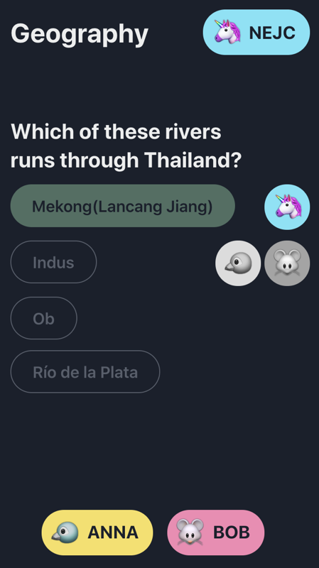

This is a serverless quiz game I am working on to strengthen my skills of building fullstack applications in Typescript.

- [The game](#the-game)
- [Current focus](#current-focus)
- [Packages](#packages)
  - [wlq-core](#wlq-core)
  - [wlq-api-aws](#wlq-api-aws)
  - [wlq-app](#wlq-app)
- [Not doing](#not-doing)

## The game

The basic idea is to have a simple Browser-based multiplayer quiz game where you can test your knowledge of Geography while competing with your friends (or other users that are currently online). It should be easy to get into and invite others.

Take a look at the live demo at [Qweel.be](https://qweel.be/room/). It is still very experimental, I will be grateful if you [add an issue](https://github.com/nejcjelovcan/wlq/issues) if you encounter any bugs.

## Current focus
While it is important to me that the game is at least playable, the main focus of this whole endeavour is:
- doing a 100% Typescript project
- making sure data models and ~~business~~ __game__ logic are decoupled from cloud service provider (currently [AWS](https://aws.amazon.com/))
- having core logic covered with unit tests (~75%)
- making use of different AWS services and trying them in a (semi) real-world scenarios 
- doing automated integration and system testing (and generally playing with CI/CD, Github actions, different code quality services such as [Codecov.io](https://codecov.io) and [dependabot](https://dependabot.com/))

The frontend part currently didn't get enough love (yet). Content is sourced from various Wikipedia lists (the name _wlq_, as well as QWeeL.be domain come from the acronym Wikipedia List Quiz), but the dataset is quite small and might be factually questionable in certain cases.

## Packages

### wlq-core
See [packages/wlq-core](packages/wlq-core)

Currently experimenting with [io-ts](https://github.com/gcanti/io-ts) for runtime data validation.

I tried to decouple most of API logic from AWS by doing inversion of control with dependency injection via two main interfaces (not doing [fp-ts](https://github.com/gcanti/fp-ts) just yet 🤪):

- [IStore](packages/wlq-core/src/model/IStore.ts) is a very simple Data Access Layer that currently has two implementations, [MemoryStore](packages/wlq-core/src/model/MemoryStore.ts) for usage in tests and [DynamoDB implementation](packages/wlq-api-aws/src/tools/room.store.ts) for data persistence in [AWS DynamoDB](https://aws.amazon.com/dynamodb/).

- [IEmitter](packages/wlq-core/src/emitter/IEmitter.ts) is an interface that allows for
  1. setting responses that can be handled by REST Lambdas to generate APIGatewayProxyResult
  2. emitting websocket events that can be handled by Websocket Lambdas to send events to open websocket connections
  3. publishing messages to notification topic (used by [AWS SNS](https://aws.amazon.com/sns/)), which then broadcasts messages to certain groups of websocket connections (Rooms)
  4. starting new state machines (used with [AWS Step functions](https://aws.amazon.com/step-functions/)) - and handling state machine task callbacks

  Emitters are currently stubbed in tests and [implemented for AWS](packages/wlq-api-aws/src/tools).

### wlq-api-aws
Backend (FaaS) part of the application is in [packages/wlq-api-aws/](packages/wlq-api-aws/) and uses [Serverless framework](https://www.serverless.com/) to define [AWS CloudFormation](https://aws.amazon.com/cloudformation/) with AWS Lambda, DynamoDB, SNS, Step functions, API Gateway...

I'm actually quite fed up with Serverless Framework and want to try out [Amazon Cloud Development Kit](https://aws.amazon.com/cdk/) or other cloud service providers (specifically Azure). Eventually some parts of the architecture might be extracted and managed in a more PaaS way.

Another thing I want explore more is Lambda@Edge (with regional DynamoDB). Multiplayer games are traditionally quite a nice fit for regional infrastructure.

### wlq-app
Browser part of the application is in [packages/wlq-app](packages/wlq-app) and uses [React](https://reactjs.org/) with [ChakraUI](https://next.chakra-ui.com/) toolkit (1.0 RC).

For state management I am trying out [Overmind](https://overmindjs.org/), dubbed "Frictional state management", which is a fairly new state management library made with Typescript in mind.

Overmind's core functionality (states, actions, effects) is quite stable and already being used by big projects in production (such as [CodeSandbox](https://codesandbox.io/)). In this project I was trying out Overmind's less stable parts, mainly statemachines (which were just recently overhauled in Overmind 0.26) as well as operators. I went a bit overboard with these, so the code needs some rethinking and cleanup. Nevertheless it is a great learning experience.

In the future I am planning to make another client implementation with [Svelte](https://svelte.dev/) (just to see what all the hype is about), there is also potential to do a native mobile client or a Unity game that uses the same API (or maybe a webgl version).

## Not doing
There are a couple of things I have thought about but are out scope for a minimal viable game. I intentionally didn't work on these:

- __Content management:__ A quiz game needs content. Scraping a couple of Wikipedia lists is not enough. I am planning to make use of [Wikidata](https://www.wikidata.org/wiki/Wikidata:Main_Page) and SPARQL and a headless CMS system for proper editorial. With a combination of automatically harvested content and human editing, there is potential to make a vast database of randomly generated quiz questions while minimizing the amount of repetitive labour.
